<div align="center">

[](https://docs.python.org/3/)
[](https://www.django-rest-framework.org/)
[](https://fastapi.tiangolo.com/)
[](https://www.postgresql.org/docs/17/)
[](https://react.dev/)
[](https://docs.docker.com/)
[](https://github.com/GoGnEt1/systeme_intelligent_d_aide_a_la_decision?tab=MIT-1-ov-file)

<br/><br/>

# SYSTEME INTELLIGENT D'AIDE A LA DECISION POUR LE E-COMMERCE PAR APPRENTISSAGE AUTOMATIQUE

<!-- ### _par Apprentissage Automatique_ -->

**Recommandation Personnalisée · Segmentation Comportementale · Prévision des Ventes**

<br/>

> Projet de Fin d'Études — Licence Génie Logiciel & Systèmes d'Information  
> Faculté des Sciences de Gabès · Université de Gabès · A.U. 2025-2026  
> **Encadrant :** M. Mahmoud Ltaief

</div>

---

## Table des matières

- [Aperçu](#-aperçu)
- [Architecture](#-architecture)
- [Modules ML](#-modules-ml)
  - [RecSys — Recommandation hybride](#recsys--recommandation-hybride-svd--ncf--tf-idf)
  - [BehaSys — Segmentation RFM + K-Means](#behasys--segmentation-comportementale-rfm--k-means)
  - [ForeSys — Prévision Prophet](#foresys--prévision-des-ventes-prophet)
- [Interface utilisateur](#-interface-utilisateur)
- [Dashboard analytique](#-dashboard-analytique)
- [Stack technique](#-stack-technique)
- [Installation](#-installation-rapide)
- [Configuration](#-configuration-env)
- [Structure du projet](#-structure-du-projet)
- [API Reference](#-api-reference)
- [Résultats expérimentaux](#-résultats-expérimentaux)
- [Auteur](#-auteur)

---

## Aperçu

**SmartShop** est une plateforme e-commerce intelligente qui intègre trois modules d'apprentissage automatique opérationnels dans une architecture microservices de production. Elle répond aux limites des solutions e-commerce actuelles (recommandations basiques, absence d'analyse comportementale, aucune prévision des ventes) par une approche ML unifiée et open-source.

### Points forts distinctifs

|                                         | SmartShop |  Amazon/Netflix   | Shopify Analytics |
| --------------------------------------- | :-------: | :---------------: | :---------------: |
| Recommandation hybride (SVD+NCF+TF-IDF) |    ✅     | ✅ (propriétaire) |   ⚠️ partielle    |
| Segmentation RFM + K-Means              |    ✅     |        ✅         |        ❌         |
| Prévision Prophet J+30                  |    ✅     |        ✅         |   ⚠️ partielle    |
| Open source & reproductible             |    ✅     |        ❌         |        ❌         |
| Architecture microservices Docker       |    ✅     |         —         |         —         |

---

## Architecture

SmartShop adopte une architecture **microservices à 4 tiers** orchestrée par Docker Compose :

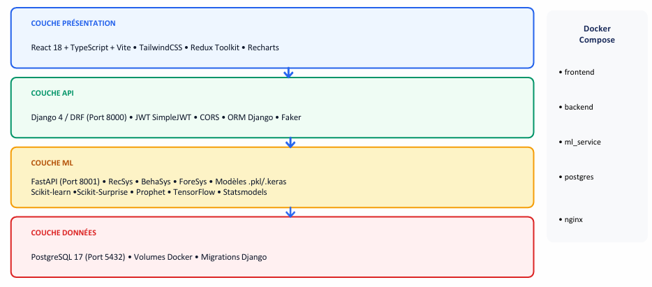

<!-- ```
┌──────────────────────────────────────────────────────────────────┐
│  COUCHE PRÉSENTATION  │  React 18 + TypeScript + TailwindCSS     │
│  (Port 5173 / Nginx)  │  Redux Toolkit · Recharts · Framer       │
├───────────────────────┼──────────────────────────────────────────┤
│  COUCHE API           │  Django 4.2 / DRF  (Port 8000)           │
│  Backend principal    │  JWT Auth · REST · Gunicorn 4 workers    │
├───────────────────────┼──────────────────────────────────────────┤
│  COUCHE ML            │  FastAPI  (Port 8001)                    │
│  Microservices        │  /ml/recommend  /ml/segment  /ml/forecast│
├───────────────────────┼──────────────────────────────────────────┤
│  COUCHE DONNÉES       │  PostgreSQL 17  (Port 5432)              │
│                       │  Volume Docker ml_models (.pkl / .keras) │
└──────────────────────────────────────────────────────────────────┘
``` -->

**Flux de communication :** React → Django (JWT) → FastAPI (calculs ML) → PostgreSQL — le tout orchestré par Docker Compose.
Cette séparation me permet de déployer et d'entraîner chaque module ML indépendamment, sans toucher au reste de l'application.

<!-- Les modèles `.pkl` et `.keras` sont persistés dans un volume Docker partagé `ml_models`. -->

---

## Modules ML

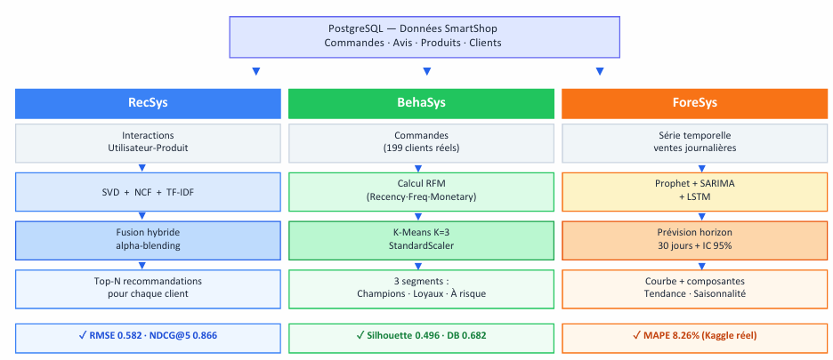

Le **pipeline global** montre comment PostgreSQL alimente les trois modules. **RecSys**, **BehaSys** et **ForeSys** sont trois services autonomes avec leurs propres endpoints, leurs propres modèles persistés, et leurs propres métriques.

### RecSys — Recommandation Hybride (SVD + NCF + TF-IDF)

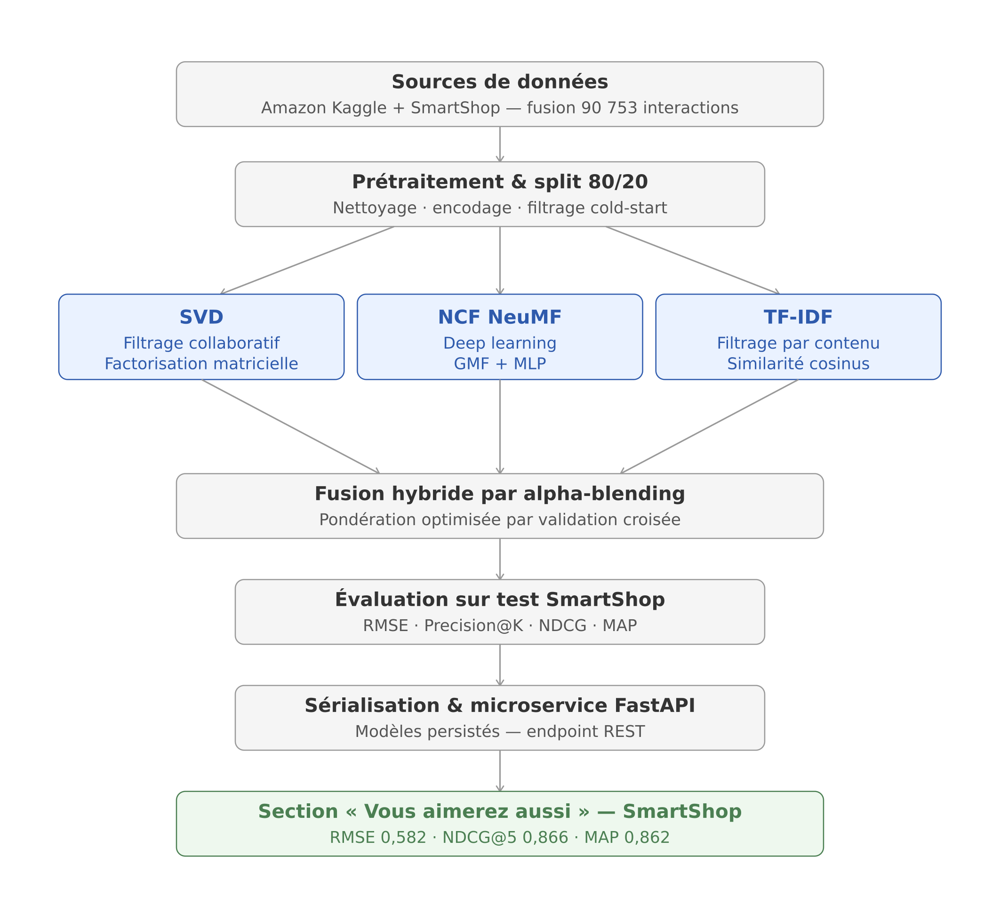

Le module RecSys combine trois approches complémentaires par **alpha-blending** :

| Modèle                    | Principe                       | Rôle dans l'hybride            |
| ------------------------- | ------------------------------ | ------------------------------ |
| **SVD** (scikit-surprise) | Factorisation matricielle      | Filtrage collaboratif          |
| **NCF NeuMF** (Keras/TF)  | GMF + MLP · embeddings dim. 32 | Relations non-linéaires        |
| **TF-IDF** (cosine sim.)  | Vecteurs description+catégorie | Cold-start & nouveaux produits |

```
score_final = αSVD × SVD(u,i) + αNCF × NCF(u,i) + αCB × CB(i)
```

**Paramètres αoptimaux** déterminés par GridSearch sur 2 000 interactions.

#### Métriques — RecSys (90 753 interactions · 18 151 test · seuil r ≥ 3.5)

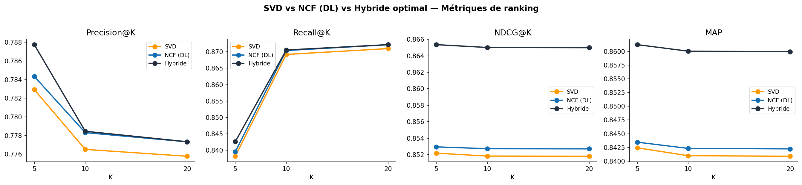

| Modèle        | RMSE ↓     | MAE ↓      | Precision@10 | NDCG@5 ↑   | MAP@5 ↑    |
| ------------- | ---------- | ---------- | ------------ | ---------- | ---------- |
| SVD baseline  | 0.7749     | 0.5421     | —            | —          | —          |
| SVD optimisé  | 0.7116     | 0.4637     | 77.65%       | 0.8526     | 0.8430     |
| NCF NeuMF     | 0.7475     | 0.3792     | 77.32%       | 0.8538     | 0.8447     |
| **Hybride ★** | **0.5820** | **0.4200** | **77.84%**   | **0.8661** | **0.8621** |

> **Hybride = BEST sur toutes les métriques de ranking.**  
> NDCG@5 = 0.866 : les produits pertinents apparaissent bien en tête de liste.  
> RMSE hybride ↓ 24.9% vs baseline SVD.

**Intégration :** `GET /ml/recommend/{user_id}` · Visiteurs non connectés → TF-IDF (cold-start résolu)

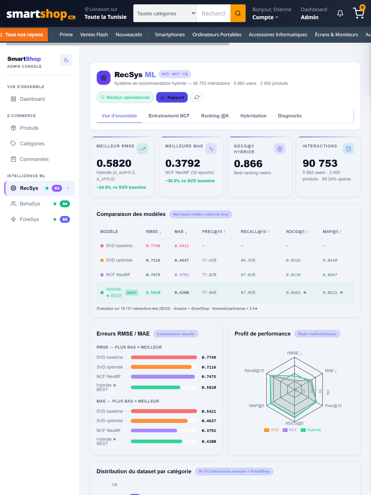

Tableau RMSE/MAE/Precision@10/NDCG · radar multi-métriques · comparaison SVD vs NCF vs Hybride

---

### BehaSys — Segmentation Comportementale RFM + K-Means

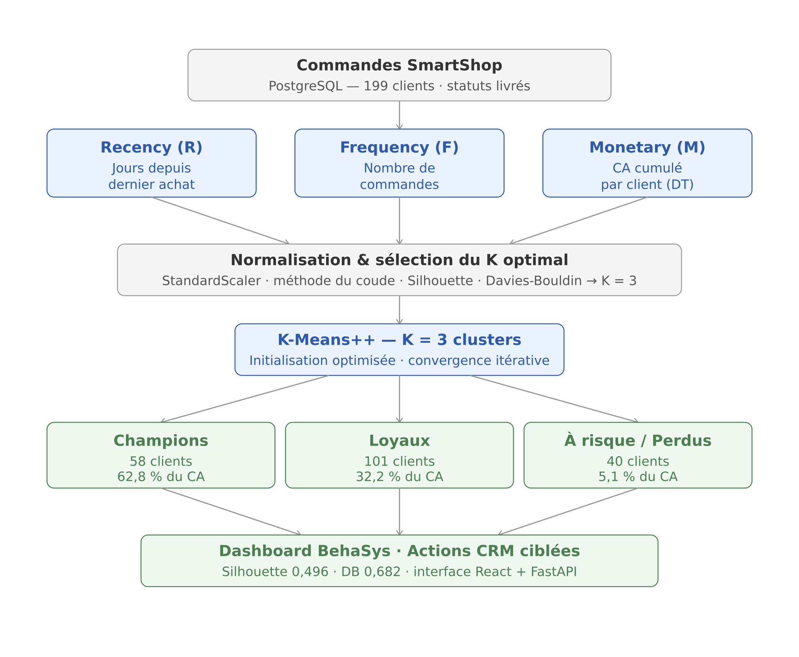

**Pipeline :** Commandes PostgreSQL → Calcul RFM → StandardScaler → K-Means++ → 3 segments → Actions CRM

<!-- #### Méthode RFM

| Dimension       | Définition                 | Interprétation                |
| --------------- | -------------------------- | ----------------------------- |
| **R** Recency   | Jours depuis dernier achat | Faible = client récent        |
| **F** Frequency | Nombre de commandes        | Élevé = client fidèle         |
| **M** Monetary  | CA cumulé (DT)             | Élevé = client à forte valeur | -->

#### Sélection du K optimal

| K     | Inertie   | **Silhouette ↑** | **Davies-Bouldin ↓** |
| ----- | --------- | ---------------- | -------------------- |
| 2     | 270.8     | 0.4828           | 0.7509               |
| **3** | **139.9** | **0.4955** ✅    | **0.6824** ✅        |
| 4     | 99.8      | 0.4238           | 0.7517               |
| 5     | 76.8      | 0.4103           | 0.7341               |

#### Résultats de segmentation (199 clients · mai 2026)

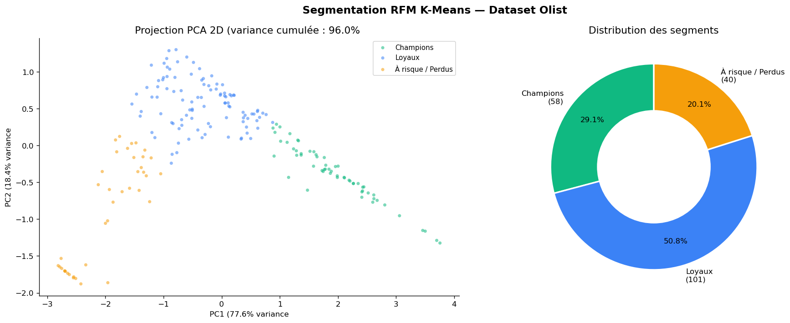

| Segment                  | Clients     | Recency | Fréquence | Monetary (DT) | % CA      | Action recommandée         |
| ------------------------ | ----------- | ------- | --------- | ------------- | --------- | -------------------------- |
| 🏆 **Champions**         | 58 (29.1%)  | 6j      | 10.0 cmd  | 77 780        | **62.8%** | Programme VIP              |
| 💙 **Loyaux**            | 101 (50.8%) | 27j     | 3.8 cmd   | 22 892        | 32.2%     | Coupons fidélité           |
| ⚠️ **À risque / Perdus** | 40 (20.1%)  | 159j    | 1.8 cmd   | 9 108         | 5.1%      | Remise réactivation 15-20% |

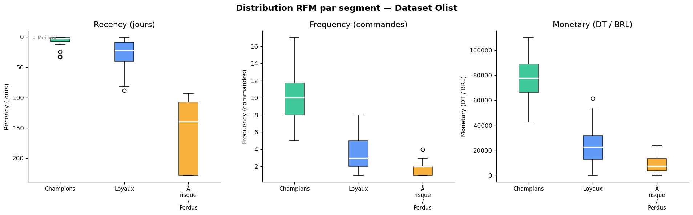

> **Impact business :** réactivation de 20% des clients "À risque" → +72 864 DT de CA additionnel.

**Intégration :** `POST /ml/predict-segment` · `GET /ml/segments-stats`

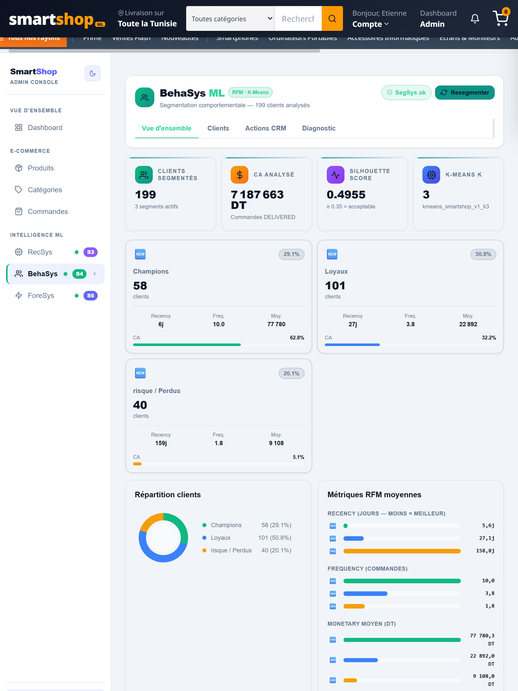

---

### ForeSys — Prévision des Ventes Prophet

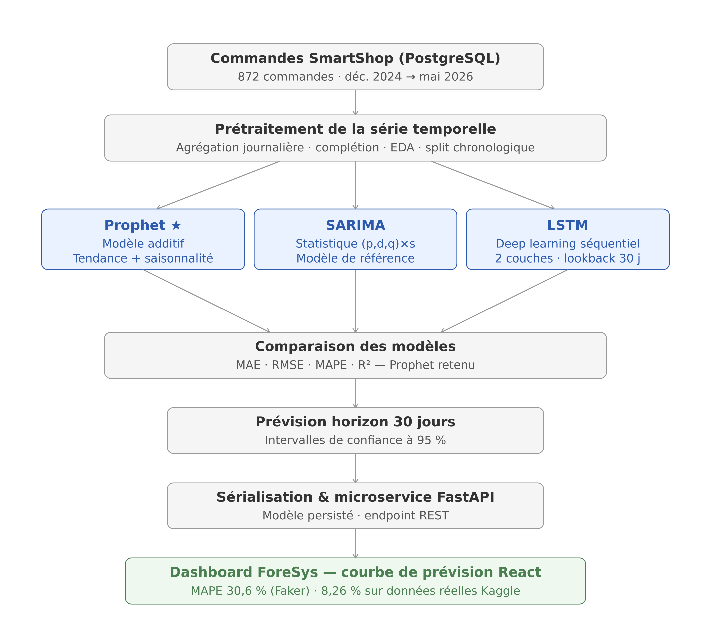

**Pipeline :** Commandes SmartShop → Agrégation journalière → Prophet fit → Prévision J+30 → IC 95%

#### Comparaison des modèles

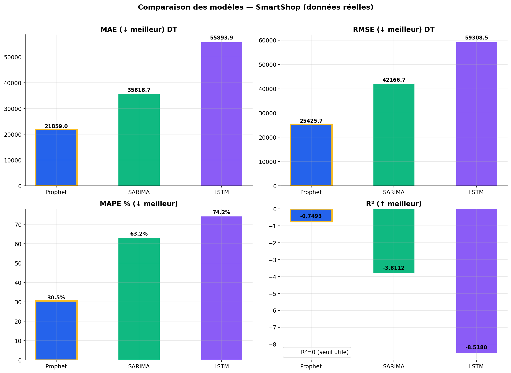

| Modèle             | MAPE ↓    | MAE (DT) ↓ | Gain vs baseline |
| ------------------ | --------- | ---------- | ---------------- |
| **Prophet ★**      | **30.6%** | **21 859** | **+50.7%**       |
| SARIMA             | 63.2%     | 35 819     | +22.2%           |
| LSTM               | 74.2%     | 55 894     | +8.6%            |
| Baseline (moyenne) | 81.2%     | 60 918     | —                |

> Sur données réelles structurées (Kaggle Store Sales Competition) : **MAPE = 8.26%, R² = 0.48**  
> Les limites sur données synthétiques sont d'ordre _data_, non algorithmique.

#### Composantes Prophet détectées

- **Tendance** : légèrement croissante sur 534 jours
- **Saisonnalité hebdomadaire** : lundi (+1 762 DT) · mercredi (−1 480 DT)
- **Saisonnalité mensuelle** : pic autour du jour de paie (fin de mois)

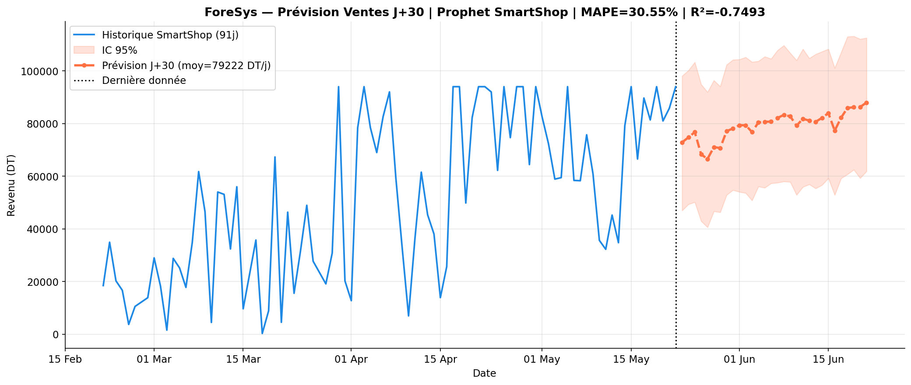

**Prévision J+30 (23 mai → 21 juin 2026) :** revenu total prévu **2 376 665 DT** · moy. **79 222 DT/j**

**Intégration :** `GET /ml/forecast/predict?horizon=30` · `GET /ml/forecast/metrics`

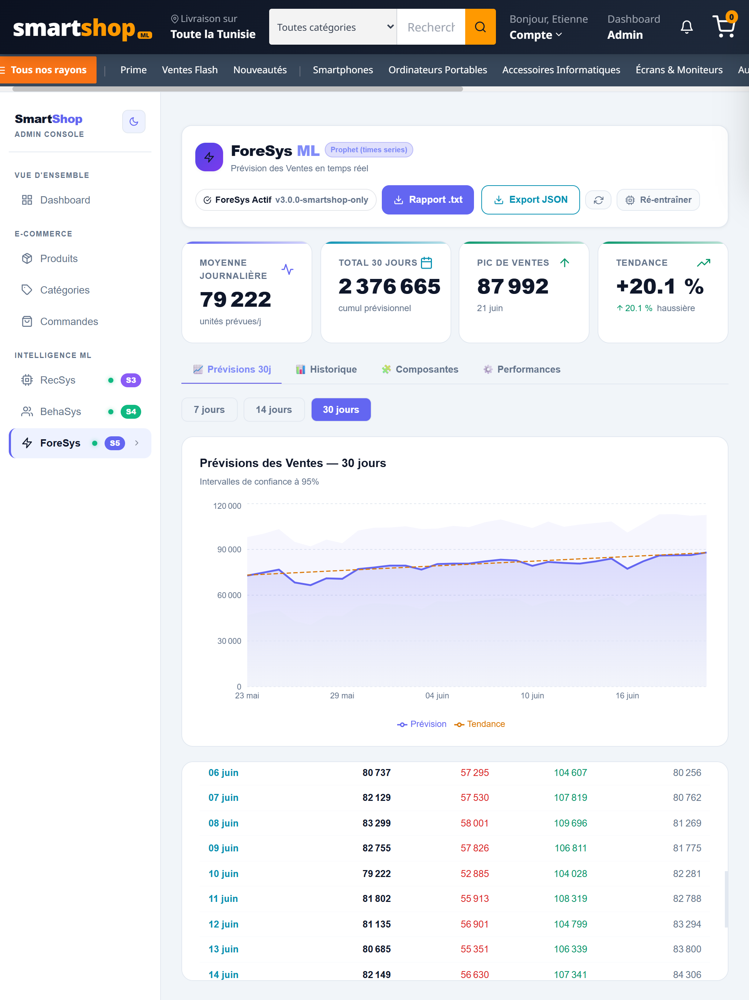

---

## Interface Utilisateur

### Page d'accueil

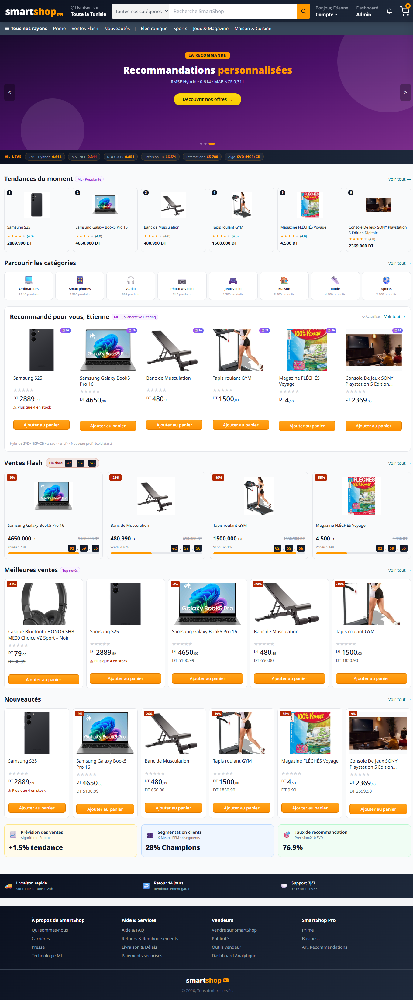

- **Bannière ML Live** : RMSE hybride · MAE NCF · NDCG@10 · interactions en temps réel
- **Recommandations personnalisées** basées sur l'historique (module RecSys)
- Tendances · Ventes Flash · Meilleures ventes · Nouveautés

### Fiche Produit

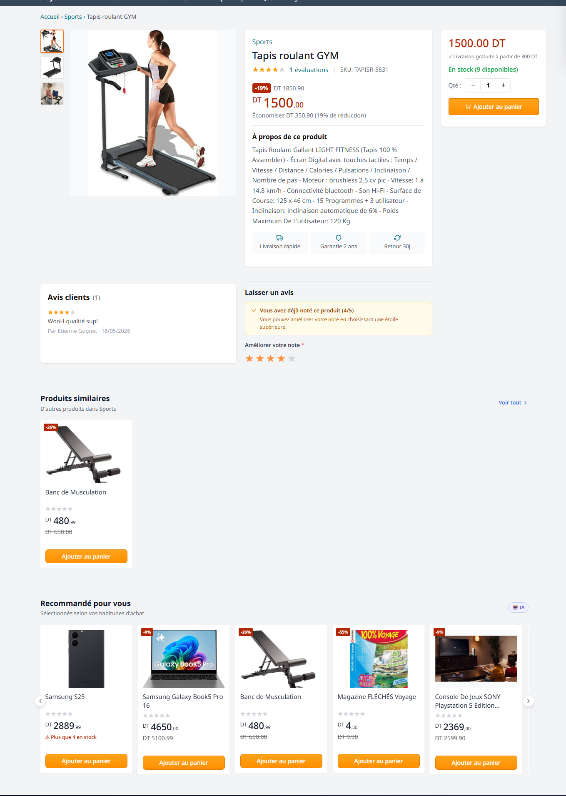

- Détails produit · galerie images · avis clients (1-5 étoiles)
- Section **Produits similaires** (TF-IDF cosine similarity)
- Section **Recommandé pour vous** (modèle hybride)

---

## 📊 Dashboard Analytique

### Vue d'ensemble KPIs

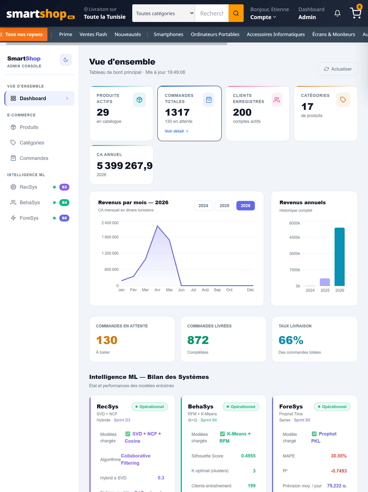

KPIs e-commerce temps réel · graphiques Recharts · bilan ML des 3 modules

---

## ⚙️ Stack Technique

<table>
<tr>
<td><b>Frontend</b></td>
<td>React 18 · TypeScript · Vite · TailwindCSS · Redux Toolkit · Recharts · Framer Motion · Axios</td>
</tr>
<tr>
<td><b>Backend</b></td>
<td>Django 4.2 · Django REST Framework · SimpleJWT · Gunicorn · django-filter · drf-spectacular</td>
</tr>
<tr>
<td><b>ML Service</b></td>
<td>FastAPI · Uvicorn · scikit-surprise · TensorFlow/Keras · Prophet · scikit-learn · pandas · pyarrow</td>
</tr>
<tr>
<td><b>Base de données</b></td>
<td>PostgreSQL 17 · SQLAlchemy · psycopg2</td>
</tr>
<tr>
<td><b>Infrastructure</b></td>
<td>Docker · Docker Compose · Nginx · Volume partagé ml_models</td>
</tr>
<tr>
<td><b>ML/Data Science</b></td>
<td>SVD (scikit-surprise) · NCF NeuMF (Keras) · TF-IDF (sklearn) · K-Means++ · Prophet · SARIMA · LSTM</td>
</tr>
</table>

---

## 🚀 Installation Rapide

### Prérequis

- Docker ≥ 24.0 & Docker Compose ≥ 2.20
- Python 3.11 (pour les notebooks Jupyter)
- Node.js 20+ (développement frontend uniquement)

### 1. Cloner le dépôt

```bash
git clone https://github.com/<votre-username>/smartshop.git
cd smartshop
```

### 2. Configurer les variables d'environnement

```bash
cp .env.example .env
# Éditer .env avec vos valeurs (voir section Configuration)
```

### 3. Lancer tous les services

```bash
docker compose up --build
```

> L'ordre de démarrage est géré automatiquement par les `healthcheck` :  
> `PostgreSQL` → `Django` (migrate + seed) → `FastAPI` (chargement modèles)

### 4. Charger les données initiales (seeding)

```bash
# Dans un autre terminal, une fois les services démarrés :
docker exec smartshop_django python manage.py seed_smartshop
```

### 5. Accéder à l'application

| Service               | URL                                          |
| --------------------- | -------------------------------------------- |
| 🛒 Frontend SmartShop | http://localhost:5173                        |
| ⚙️ API Django         | http://localhost:8000/api/                   |
| 📡 ML Service FastAPI | http://localhost:8001/docs                   |
| 🗄️ pgAdmin            | http://localhost:5432                        |
| 📚 Swagger UI         | http://localhost:8000/api/schema/swagger-ui/ |

### 6. Entraîner les modèles ML (optionnel)

Les notebooks Jupyter se trouvent dans `ml_service/notebooks/` :

```bash
cd ml_service/notebooks
jupyter notebook Sprint3_Recommandation_final.ipynb     # RecSys
jupyter notebook S4_Segmentation_RFM_KMeans_Final.ipynb   # BehaSys
jupyter notebook S5_SmartShop_Final.ipynb    # ForeSys
```

Les modèles exportés (`.pkl`, `.keras`, `.parquet`) sont automatiquement chargés par FastAPI au démarrage.

---

## 🔧 Configuration (.env)

```env
# ── Base de données ─────────────────────────────
POSTGRES_DB=smartshop_db
POSTGRES_USER=smartshop_user
POSTGRES_PASSWORD=your_secure_password
POSTGRES_HOST=postgres
POSTGRES_PORT=5432

# ── Django ──────────────────────────────────────
SECRET_KEY=your-very-secret-django-key-change-in-production
DEBUG=True
ALLOWED_HOSTS=localhost,127.0.0.1

# ── Communication inter-services ────────────────
ML_SERVICE_URL=http://fastapi:8001
CORS_ALLOWED_ORIGINS=http://localhost:5173,http://localhost:3000

# ── Email (notifications transactionnelles) ─────
EMAIL_HOST=smtp.gmail.com
EMAIL_PORT=587
EMAIL_HOST_USER=your@gmail.com
EMAIL_HOST_PASSWORD=your_app_password
DEFAULT_FROM_EMAIL=SmartShop <your@gmail.com>

# ── pgAdmin ─────────────────────────────────────
PGADMIN_DEFAULT_EMAIL=admin@smartshop.tn
PGADMIN_DEFAULT_PASSWORD=admin_password
```

---

## 📁 Structure du Projet

```
smartshop/
├── backend/                        # Django 4.2 / DRF
│   ├── apps/
│   │   ├── users/                  # Authentification JWT · profils
│   │   ├── products/               # Catalogue · catégories · avis
│   │   ├── orders/                 # Panier · commandes · livraison
│   │   ├── payements/              # Paiements (COD, Mobile, Card)
│   │   ├── recommendations/        # Proxy Django → FastAPI RecSys
│   │   └── analytics/              # KPIs · CustomerSegment · GiftOffer
│   ├── seeders/                    # Scripts de données initiales
│   │   ├── user_seeder.py
│   │   ├── category_product_seeder.py
│   │   ├── order_seeder.py         # Seeder v3 avec tendance volume
│   │   └── review_seeder.py
│   └── requirements.txt
│
├── ml_service/                     # FastAPI · Microservices ML
│   ├── routers/
│   │   ├── recommendation.py       # GET /ml/recommend/{user_id}
│   │   ├── segmentation.py         # POST /ml/predict-segment
│   │   └── forecast.py             # GET /ml/forecast/predict
│   ├── models/                     # Modèles pré-entraînés (.pkl, .keras, .parquet)
│   │   ├── svd_model.pkl
│   │   ├── ncf_model.keras
│   │   ├── kmeans_rfm.pkl
│   │   ├── prophet_sales_ts_forecast.pkl
│   │   └── ...
│   ├── notebooks/                  # Jupyter — entraînement & évaluation
│   │   ├── S3_Recommandation.ipynb
│   │   ├── S4_Segmentation_RFM.ipynb
│   │   └── S5_SmartShop_Final.ipynb
│   └── requirements.txt
│
├── frontend/                       # React 18 + TypeScript
│   ├── src/
│   │   ├── pages/
│   │   │   ├── HomePage.tsx
│   │   │   ├── ProductDetailPage.tsx
│   │   │   ├── CartPage.tsx
│   │   │   └── admin/
│   │   │       ├── DashboardTab.tsx
│   │   │       ├── AnalyticDashboard.tsx  # RecSys
│   │   │       ├── SegmentationDashboard.tsx  # BehaSys
│   │   │       └── ForeSysDashboard.tsx
│   │   ├── store/
│   │   │   ├── authSlice.ts
│   │   │   ├── cartSlice.ts
│   │   │   ├── mlSlice.ts
│   │   │   └── forecastSlice.ts
│   │   └── components/
│   └── package.json
│
├── docker-compose.yml
├── .env.example
└── README.md
```

---

## 📡 API Reference

### Authentification

```http
POST   /api/auth/register/           # Inscription
POST   /api/auth/login/              # Connexion → access + refresh tokens
POST   /api/auth/token/refresh/      # Renouvellement token
POST   /api/auth/logout/             # Déconnexion + blacklist
```

### E-Commerce

```http
GET    /api/products/                # Liste produits (filtres, pagination)
GET    /api/products/{id}/           # Détail produit
GET    /api/orders/cart/             # Panier courant
POST   /api/orders/                  # Passer une commande
GET    /api/orders/                  # Historique commandes
POST   /api/products/{id}/reviews/   # Déposer un avis
```

### Machine Learning (via proxy Django → FastAPI)

```http
GET    /api/recommendations/?user_id=&product_id=   # Recommandations personnalisées
GET    /api/analytics/segments-stats/                # Statistiques segmentation
POST   /api/analytics/gift-offers/                  # Créer offre cadeau ciblée
GET    /api/analytics/forecast/                      # Prévisions des ventes
```

### FastAPI ML Service (direct)

```http
GET    /ml/recommend/{user_id}               # Top-N recommandations
POST   /ml/predict-segment                   # Prédire segment RFM
GET    /ml/segments-stats                    # Stats clustering K-Means
GET    /ml/forecast/predict?horizon=30       # Prévision Prophet J+30
GET    /ml/forecast/metrics                  # MAE · RMSE · MAPE · R²
GET    /ml/health                            # Status des 3 modules ML
GET    /ml/stats                             # Métriques RecSys complètes
```

---

## 📈 Résultats Expérimentaux

### Module RecSys

```
Interactions totales  : 90 753   (Amazon Kaggle + SmartShop)
Utilisateurs          : 5 982
Produits              : 2 000
Sparsité              : 99.24%
Split                 : 80% entraînement / 20% test (chronologique)

RMSE Hybride          : 0.5820   ↓ 24.9% vs SVD baseline
MAE  NCF              : 0.3792   ↓ 30.0% vs SVD baseline
NDCG@5 Hybride        : 0.866    → pertinence en tête de liste
Precision@10          : 77.84%
MAP@5                 : 0.862
```

### Module BehaSys

```
Clients analysés      : 199
Segments              : 3  (K=3 optimal)
Silhouette Score      : 0.4955   ≥ 0.35 = acceptable
Davies-Bouldin        : 0.6824   < 1.0  = bonne séparation
CA analysé            : 7 187 663 DT

Champions (29.1%)     : Recency 6j  · Freq. 10.0 · Moy. 77 780 DT → 62.8% CA
Loyaux    (50.8%)     : Recency 27j · Freq. 3.8  · Moy. 22 892 DT → 32.2% CA
À risque  (20.1%)     : Recency 159j· Freq. 1.8  · Moy. 9 108 DT  →  5.1% CA
```

### Module ForeSys

```
Données               : 534 jours (déc. 2024 → mai 2026)
Revenu total          : 6 131 567 DT
Revenu moyen          : 29 910 DT/j

Prophet MAPE          : 30.6%   sur données SmartShop (synthétiques)
Prophet MAPE Kaggle   : 8.26%   sur données réelles structurées → robustesse validée
Gain vs baseline      : +50.7%  (baseline : prédire la moyenne = MAPE 81.2%)

Prévision J+30        : 2 376 665 DT  (79 222 DT/j moy.)
Tendance détectée     : +20.1% hausse
```

---

## 🗂️ Sprints Agile Scrum

| Sprint | Module                   | Réalisations                                                      |
| ------ | ------------------------ | ----------------------------------------------------------------- |
| **S1** | Infrastructure           | Docker Compose · PostgreSQL · Django init · React+Vite · JWT auth |
| **S2** | E-Commerce Core          | Catalogue · Panier · Commandes · UI React complète                |
| **S3** | RecSys                   | SVD + NCF + TF-IDF · Hybride α-blending · FastAPI endpoint        |
| **S4** | BehaSys                  | RFM pipeline · K-Means++ · Segmentation 3 clusters · Actions CRM  |
| **S5** | ForeSys                  | Prophet + SARIMA + LSTM · Prévision J+30 · Dashboard ForeSys      |
| **S6** | Dashboard & Optimisation | KPIs temps réel · AnalyticDashboard · Intégration ML              |

---

## 👤 Auteur

**Gnimanvo Etienne GOUDJANOUSSI**  
Étudiant en Licence Génie Logiciel & Systèmes d'Information  
Faculté des Sciences de Gabès · Université de Gabès

Stage académique — Février à Mai 2026  
Encadrant : **M. Mahmoud Ltaief**  
Jury : Mme. Eya Ben Charrada (Présidente) · Mme. Sabrine Ben Ali (Examinatrice)

[](https://www.linkedin.com/in/etienne-goudjanoussi-764784303/)
[](https://github.com/GoGnEt1)

---

## 📄 Licence

Ce projet est distribué sous licence **MIT**. Voir le fichier [LICENSE](LICENSE) pour plus de détails.

---

<div align="center">

_SmartShop démontre qu'une plateforme e-commerce intelligente, intégrant la recommandation,  
la segmentation et la prévision, est réalisable en production avec des technologies open source._

⭐ **N'hésitez pas à mettre une étoile si ce projet vous a été utile !**

</div>
